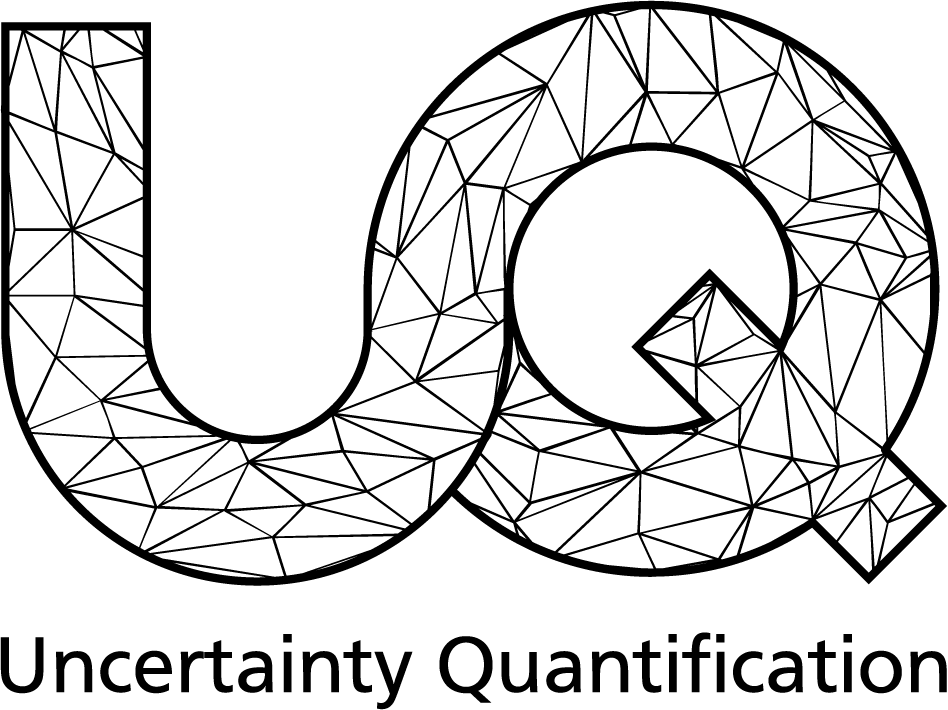

# SPIN: Stochastic Process INference [](https://www.scc.kit.edu/forschung/uq.php)

SPIN is a Python package for the non-parametric Bayesian inference of the parameter functions of autonomous diffusion processes.
It can be used to infer the drift function $\mathbf{b}: \Omega\to\mathbb{R}^d$ and (squared) diffusion function $\mathbf{\Sigma}:\Omega\to\mathbb{R}^{d\times d}$ from trajectory data of an underlying process $\mathbf{X}_t$ on a domain $\Omega\subset\mathbb{R}^d$, indexed over $t\in\mathbb{R}_+$,

$$
    d\mathbf{X}_t = \mathbf{b}(\mathbf{X}_t) dt + \sqrt{\mathbf{\Sigma}(\mathbf{X}_t)} d\mathbf{W}_t,\quad \mathbf{X}(t=0)=\mathbf{X}_0\ a.s.
$$

Under the hood, SPIN employs a PDE-based inference method, based on the **Kolmogorov equations** governing
the stochastic process under consideration. For more information on the underlying theory, we refer to the
**accompanying publication**,

!!! note ""
    **[Non-parametric Inference for Diffusion Processes:
    A Computational Approach via Bayesian Inversion
    for PDEs](https://arxiv.org/abs/2411.02324)**

### Key Features
:material-checkbox-marked-circle-outline: &nbsp; **Non-parametric inference of drift and diffusion functions** <br>
:material-checkbox-marked-circle-outline: &nbsp; **Works with stationary and time-dependent trajectory data** <br>
:material-checkbox-marked-circle-outline: &nbsp; **PDE computations based on the finite element method** <br>
:material-checkbox-marked-circle-outline: &nbsp; **Evaluation of the maximum a-posteriori estimate and Laplace approximation** <br>
:material-checkbox-marked-circle-outline: &nbsp; **Generic and robust implementation, based on [hIPPYlib](https://dl.acm.org/doi/10.1145/3428447) and [FEniCS](https://fenicsproject.org/)**


## Installation and Development

SPIN depends on a mixture of pip and conda dependencies, which can be efficiently managed using [Pixi](https://pixi.sh/latest/). To set up a virtual environment in which SPIN can be run, simply execute in the project root directory:

```bash
pixi install
```

## Documentation

A walk-through for solving a simple inference problem with SPIN is given in the [Tutorial](usage/tutorial.md).
We further provide [runnable examples](https://github.com/UQatKIT/SPIN/tree/main/examples) for different
use-cases in our Github repository.
For more information regarding the implementation of SPIN, we refer to the API reference.

## Acknowledgement and License

SPIN is being developed in the research group [Uncertainty Quantification](https://www.scc.kit.edu/forschung/uq.php) at KIT.
Large portions of SPIN are based on the [hIPPYlib](https://dl.acm.org/doi/10.1145/3428447) software library for large-scale (Bayesian) inverse problems. hIPPYlib, in turn, uses [FEniCS](https://fenicsproject.org/) for finite element computations.
SPIN is distributed as free software under the [MIT License](https://choosealicense.com/licenses/mit/).