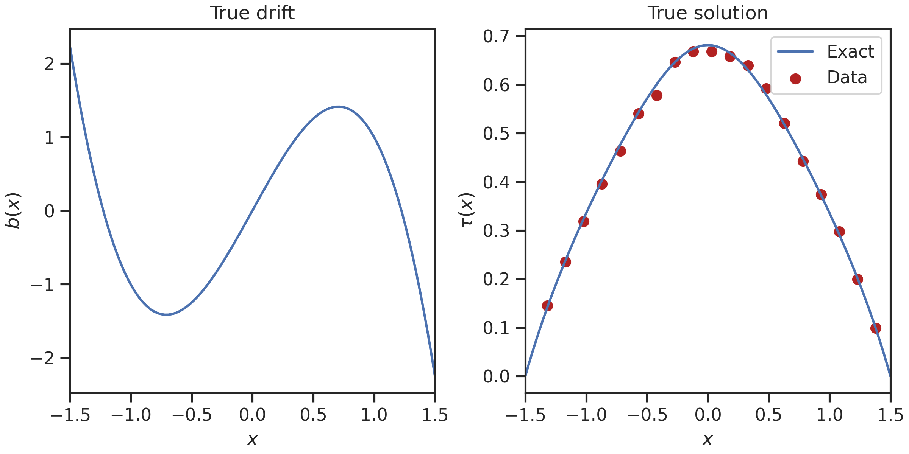
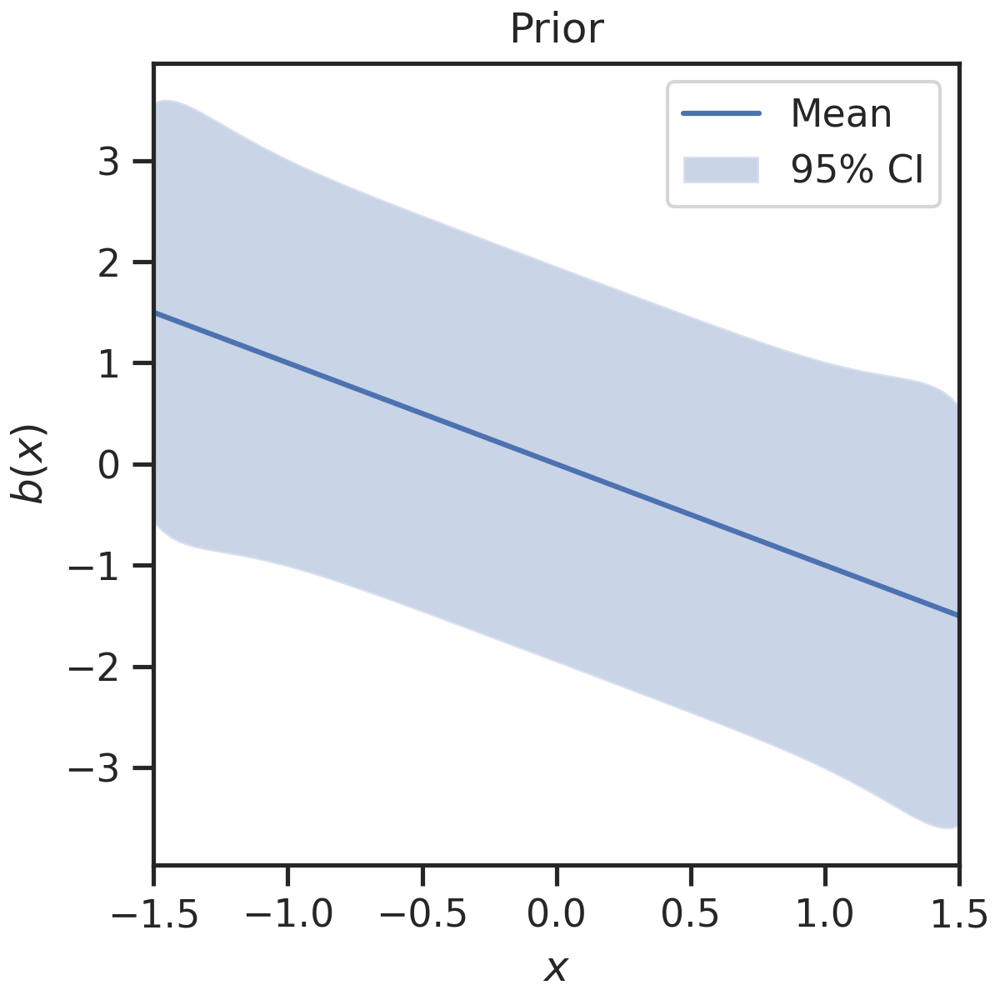
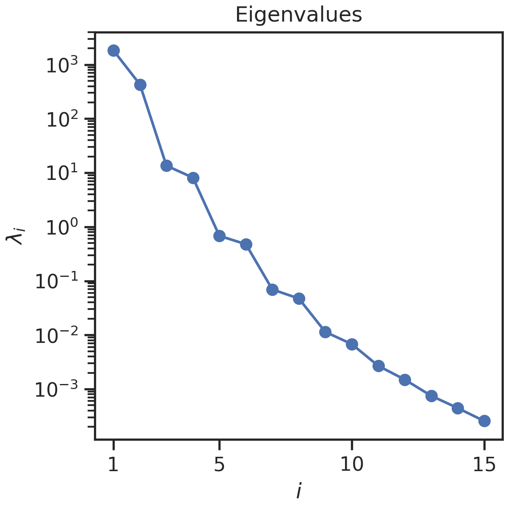

# Tutorial

## Imports

```py
import dolfin as dl
import hippylib as hl
import numpy as np
```

```py
from spin.core import problem
from spin.fenics import converter
from spin.hippylib import hessian, laplace, misfit, optimization, prior
```

## SPIN Problem Setup

```py
mesh = dl.IntervalMesh(100, -1.5, 1.5)
```

```py
problem_settings = problem.SPINProblemSettings(
    mesh=mesh,
    pde_type="mean_exit_time",
    inference_type="drift_only",
    log_squared_diffusion=("std::log(std::pow(x[0],2) + 2)",),
)
```

```py
problem_builder = problem.SPINProblemBuilder(problem_settings)
spin_problem = problem_builder.build()
```

## Ground Truth and Data

```py
parameter_coordinates = spin_problem.coordinates_parameters
solution_coordinates = spin_problem.coordinates_variables
```

```py
true_parameter = converter.create_dolfin_function(
    ("-2*std::pow(x[0],3) + 3*x[0]",), spin_problem.function_space_parameters
)
true_parameter = converter.convert_to_numpy(
    true_parameter.vector(), spin_problem.function_space_parameters
)
```

```py
true_solution = spin_problem.solve_forward(true_parameter)
```

```py
noise_std = 0.01
data_stride = 5
rng = np.random.default_rng(seed=0)
data_locations = solution_coordinates[4:-5:data_stride]
data_values = true_solution[4:-5:data_stride]
noise = rng.normal(loc=0, scale=noise_std, size=data_values.size)
data_values = data_values + noise
```

<figure markdown="span">
  { width="800" }
</figure>

## Prior

```py
prior_settings = prior.PriorSettings(
    function_space=spin_problem.function_space_parameters,
    mean=("-x[0]",),
    variance=("1",),
    correlation_length=("1",),
    robin_bc=True,
    robin_bc_const=3.0,
)
```

```py
prior_builder = prior.BilaplacianVectorPriorBuilder(prior_settings)
spin_prior = prior_builder.build()
```

```py
prior_variance = spin_prior.compute_variance_with_boundaries(
    method="Randomized", num_eigenvalues_randomized=50
)
```

<figure markdown="span">
  { width="500" }
</figure>

## Misfit

```py
misfit_settings = misfit.MisfitSettings(
    function_space=spin_problem.function_space_variables,
    observation_points=data_locations,
    observation_values=data_values,
    noise_variance=np.ones(data_values.shape) * noise_std**2,
)
```

```py
misfit_builder = misfit.MisfitBuilder(misfit_settings)
spin_misfit = misfit_builder.build()
```

## Hippylib Inference Model

```py
inference_model = hl.Model(
    spin_problem.hippylib_variational_problem,
    spin_prior.hippylib_prior,
    spin_misfit.hippylib_misfit,
)
```


## Maximum A-Posteriori Estimate
```py
    optimization_settings = optimization.SolverSettings(
    relative_tolerance=1e-8,
    absolute_tolerance=1e-12,
    verbose=True
)
```

```py
initial_guess = spin_prior.mean_array
newton_solver = optimization.NewtonCGSolver(optimization_settings, inference_model)
solver_solution = newton_solver.solve(initial_guess)
print("Termination reason:", solver_solution.termination_reason)
```

```
It  cg_it cost            misfit          reg             (g,dm)          ||g||L2        alpha          tolcg         
  1   1    1.889616e+03    1.887812e+03    1.803933e+00   -5.170915e+04   3.219192e+04   1.000000e+00   5.000000e-01
  2   1    5.076705e+01    4.661511e+01    4.151942e+00   -3.753275e+03   4.502810e+03   1.000000e+00   3.739972e-01
  3   1    1.189700e+01    7.168961e+00    4.728040e+00   -7.779092e+01   4.729717e+02   1.000000e+00   1.212116e-01
  4   4    9.256516e+00    4.326960e+00    4.929556e+00   -5.257498e+00   3.392275e+01   1.000000e+00   3.246176e-02
  5   5    9.103538e+00    4.016698e+00    5.086840e+00   -3.082656e-01   6.164694e+00   1.000000e+00   1.383829e-02
  6   6    9.101899e+00    4.011858e+00    5.090041e+00   -3.276268e-03   7.549289e-01   1.000000e+00   4.842611e-03
  7   8    9.101899e+00    4.011912e+00    5.089987e+00   -2.642558e-07   6.848649e-03   1.000000e+00   4.612421e-04
Termination reason: Norm of the gradient less than tolerance
```

## Low-Rank Hessian Approximation

```py
hessian_settings = hessian.LowRankHessianSettings(
    num_eigenvalues=15,
    num_oversampling=5,
    inference_model=inference_model,
    evaluation_point=[
        solver_solution.forward_solution,
        solver_solution.optimal_parameter,
        solver_solution.adjoint_solution,
    ],
)
```

```py
eigenvalues, eigenvectors = hessian.compute_low_rank_hessian(hessian_settings)
```

<figure markdown="span">
  { width="500" }
</figure>

## Laplace Approximation

```py
laplace_approximation_settings = laplace.LowRankLaplaceApproximationSettings(
    inference_model=inference_model,
    mean=solver_solution.optimal_parameter,
    low_rank_hessian_eigenvalues=eigenvalues,
    low_rank_hessian_eigenvectors=eigenvectors,
)
```

```py
laplace_approximation = laplace.LowRankLaplaceApproximation(laplace_approximation_settings)
```

```py
posterior_variance = laplace_approximation.compute_pointwise_variance(
    method="Randomized", num_eigenvalues_randomized=50
)
posterior_predictive = spin_problem.solve_forward(solver_solution.optimal_parameter)
```

<figure markdown="span">
  { width="800" }
</figure>